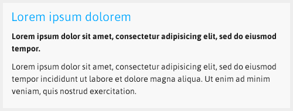
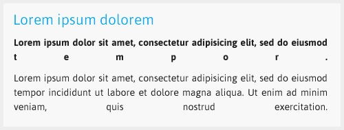
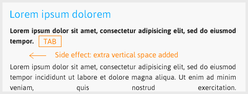
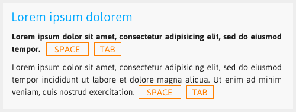

---json
{
    "title": "Adobe Fireworks justified paragraph fix",
    "excerpt": "Setting the text align property of a text box to justify in Adobe Fireworks comes with an annoying bug: the last line stretches to full width (aka full justified). Fortunately there is an easy solution.",
    "date": "2013-08-02",
    "img": "adobe-fireworks-justified-paragraph-fix-01.png",
    "bgImg": "dev-asangbam-96inBk3BGcI-unsplash.webp",
    "bgImgUrl": "https://unsplash.com/photos/96inBk3BGcI",
    "legacyURL": "https://blog.rolandtoth.hu/post/57133806707/adobe-fireworks-justified-paragraph-fix",
    "tags": [
        "fireworks"
    ],
    "type": "post",
    "layout": "layouts/@post.njk"
}
---

## The Problem

The starting scenario: left-aligned text, no issues:

Setting a paragraph to justified results this:

Last lines of paragraphs are stretched to full width. That is not something to show the client, isn’t it?

Adding TAB to the end of paragraphs usually fixes such issues in other applications. That works here too but not without negative side effects, namely an extra vertical space appears after the paragraph. Trying setting "space after paragraph" to zero does not help, the extra space remains:

## Almost there...

And finally, the winning combo: space + TAB:

As you can see this workaround is still manual but it does not break paragraph flow. The text box can be still edited or reformatted, it remains justified. I wish I have discovered it earlier, it would have saved me a lot of time (and headache).