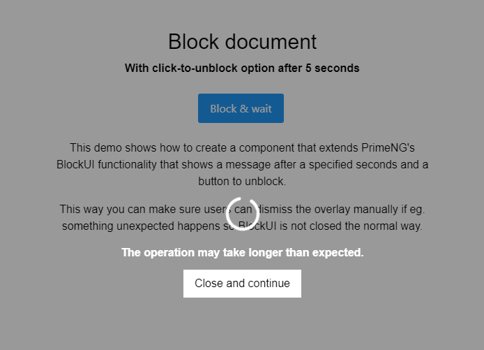

---json
{
    "title": "Angular PrimeNG Closable BlockUI",
    "excerpt": "The BlockUI component of PrimeNG is great, but could be even greater if there were an option to manually close after a specified amount of time.",
    "img": "angular-primeng-closable-blockui.png",
    "date": "2021-02-06",
    "tags": [
        "angular",
        "primeng"
    ],
    "type": "post",
    "layout": "layouts/@post.njk"
}
---

Despite all my best efforts to create an application that could properly handle the closing of PrimeNG's BlockUI overlays I always ended up with some overlays not closing. Probably it's only my weak code but I wanted to make sure to eliminate this, and a good candidate was to create a new wrapper component around the stock BlockUI.

The idea was that this new component will have a view with a button to close. At first everything went smooth, the new component got the boolean "blocked" variable via an @Input() variable. However, I oversaw that changes to the new component's variable won't update the original one. That is, when the overlay was closed, the original component's variable remained intact ("true"). I learned that I would need to use the Angular OnChanges lifecycle hook, but even doing so, nothing happenned.

I almost gave it up because I thought that the only way is to subscribe each component to the changes of the "blocked" variable, which would be too messy and wouldn't worth the trouble. The underlying problem was that Angular doesn't detect changes to a variable that wasn't changed, which kinda makes sense. In this case, the parent's flag to show the blocking overlay was changed from "true" to "true", triggering nothing.

What I needed was to somehow notify the parent component about the changes in the new AppBlocker component. To solve this I made an @Output variable and finally it worked, resulting in a really succinct one-liner:

```javascript
<app-blocker
    [blocked]="blockedDocument"
    (onClose)="blockedDocument = false"
    [displayMessageAfter]="5000">
</app-blocker>
```

## Demo



[https://stackblitz.com/edit/primeng-blockui-demo-b3uzwy](https://stackblitz.com/edit/primeng-blockui-demo-b3uzwy)

## Breaking it down

- the parent component's "blockedDocument" variable gets passed to the new AppBlocker component, so that it can forward it to its child BlockUI component
- the AppBlocker component has a button that triggers an event emitter, that emits its new value to the parent component. This value isn't really used because it's always "false", but when it happens, the "blockedDocument" variable is immediately set to "false". This way both components' blocked flags are in sync, and what's more important, Angular's OnChange can detect changes
- the AppBlocker component reacts the changes of its "blocked" variable via the OnChanges lifecycle hook, and then starts its inner countdown
- when the countdown completes, the message is shown with a button to dismiss the overlay

## TL;DR

It was a nice journey that fortunately came to a happy ending. Looking back it's a very simple one, but only because I now know more about Angular's inner workings.
