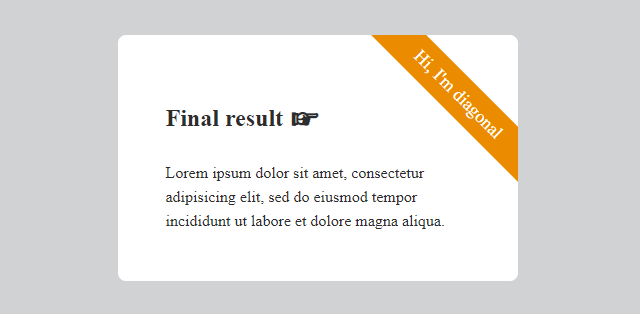

---json
{
    "title": "CSS Diagonal Corner Text Stripe",
    "excerpt": "CSS solution for a diagonal corner text stripe that adjusts itself to its text content.",
    "date": "2023-06-04",
    "img": "css-diagonal-corner-text-stripe.png",
    "tags": [
        "css"
    ],
    "type": "post",
    "layout": "layouts/@post.njk"
}
---

## How it started

I needed a text to put diagonally to a pricing table so I started to google for some help, hoping for a quick win. But I came up empty handed for one that is capable of displaying variable length of text properly. Probably I could spend more time on search but at that point I felt it was time to get my hands dirty with CSS.

## How it continued

My first attempt failed. I blame it on myself not doing real CSS for long months lately.

## How it went forward

I figured out that the easiest way would be placing a square DIV to the top-right corner of the element, then put the text in its bottom and rotate the whole thing by 45 degree. This way the stripe would accommodate to the width of the text automatically.

For this I needed the aspect ratio (padding hack) to ensure that the container element is always of the same height as its width.

The actual stripe's left and right sidess weren't touching the parent element's sides, so I needed to pull it up by 50%, using translateY.

And actually that was all there is to it, the rest was just plain CSS formatting.

## Demo

Make sure to hover over the bottom card to see the explanatory animation:

[https://codepen.io/rolandtoth/full/dyQbXjW](https://codepen.io/rolandtoth/full/dyQbXjW)

## Conclusion

I'm almost sure I'm not the only one who has solved the issue this way. However, since I failed to find such an article I thought it could come handy for others too.