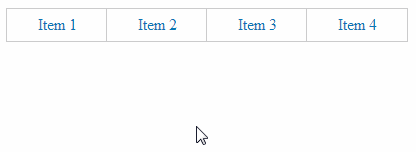

---json
{
    "title": "CSS3 Fade Dropdown Menu Done Right",
    "excerpt": "In the new CSS3 era it is easy to create nice animated dropdown menus without JavaScript. However, the fade effect may need an extra step to do it right.",
    "img": "css3-fade-dropdown-menu-done-right.png",
    "bgImg": "masaaki-komori-961MQXpmY5o-unsplash.webp",
    "bgImgUrl": "https://unsplash.com/photos/961MQXpmY5o",
    "date": "2014-05-30",
    "legacyURL": "https://blog.rolandtoth.hu/post/87275112477/css3-fade-dropdown-menu-done-right",
    "tags": [
        "css"
    ],
    "type": "post",
    "layout": "layouts/@post.njk"
}
---

Simple animations are done using the transition property where you can set the property to animate, the animation duration, the timing function and transition delay:

```css
transition: width 1s linear 2s;
```

Speaking of menus you most likely need a fade effect so the display property would be the the best candidate to animate. The oldschool way is to hide the submenu using display: none and show it on hovering on its parent element with display: block. It works but there is a problem: no animation will take place.

## Visibility + Opacity To The Rescue

Another way of hiding an element is setting its visibility to hidden. But that still won’t fade unless you toggle the opacity from 0 to 1. Combining the two will produce a nice fade effect.

## Final Touch: Toggle Pointer Events

Though basically we are done you may notice the submenu re-appear when moving the mouse on and off the submenu. This is because you hover on the submenu before it entirely fades out, triggering the hover state again.

This can be solved easily by detaching pointer events and re-attach them on hovering the parent element. To do this, use

```css
pointer-events: none;
```

to remove all handlers (including hover), and

```css
pointer-events: auto;
```

to restore them. This way if you move the mouse off the submenu and quickly move the mouse back on it, the submenu won’t appear again. I use this solution because it causes less frustration, even though it is not supported below IE11. Also don’t forget to add vendor prefixes to transition rules.

## The Long-Awaited Demo

Here is a quick demo where you can toggle the hiding method (visibility and display) and the pointer-events hack.

{{ "https://codepen.io/rolandtoth/pen/DEtFC" | codepenEmbed("CSS Fade Dropdown Menu") | safe }}

Notice how the submenu comes back when the pointer-events hack is disabled:


