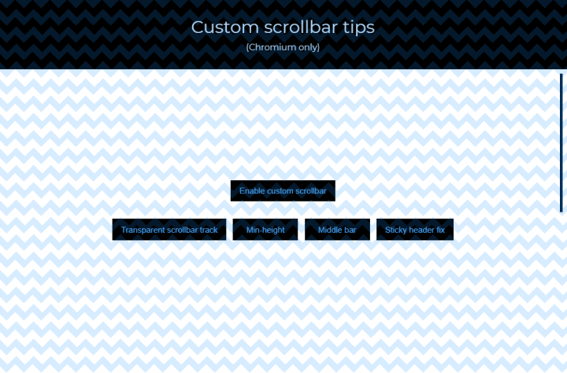

---json
{
    "title": "Custom scrollbar tips (Chromium only)",
    "excerpt": "Chromium allows easy scrollbar modifications via CSS, even though the possibilities are somewhat limited. Here are some tips on how to achieve things that first may seem unsupported.",
    "date": "2020-12-12",
    "img": "custom-scrollbar-tips.png",
    "tags": [
        "css"
    ],
    "type": "post",
    "layout": "layouts/@post.njk"
}
---

## Demo

Let's start with the demo where you can toggle these features on/off:

- transparent scrollbar track
- fix for scrollbar track being too small on tall pages
- use thinner scrollbar track ("middle bar")
- offset for sticky headers

[https://codepen.io/rolandtoth/full/poERvVY](https://codepen.io/rolandtoth/full/poERvVY)

## Transparent scrollbar track

Setting the scrollbar (or track) background to transparent won't give you the desired result. In fact it probably does, but what's really going on here is that the page (the html element) is to the right of the scrollbar and not below it. This means we need to find a way to force this, and we can do it by setting `overflow-y: overlay`. This way the main background color of the page stretches to the edge there's no white background below the scrollbar.

## Setting scrollbar track minimum height

This was an easy fix that I used in a recent project where a page grew too large, so the scrollbar track was too tiny. I applied `min-height` to the track and to my great surprise it worked.

The good thing is that nothing else needs to be modified, the browser automatically figures out offsets and everything, so you can't "overscroll" on neither edges.

## Thin scrollbar track in the middle

While you can set the desired width of the scrollbar, it will start from the edge. If you would like to offset it somehow, the usual margin or even transform CSS rules won't work here. I figured out that by setting a transparent border together with `background-clip: padding-box` does the trick. With this, you can play around with width and border width settings to get the final result you need.

The nice thing about this is that you actually get a transparent padding so the entire scrollbar width is available for dragging with the mouse, not only the thin track bar.

## Fix for sticky headers

The scrollbar is above everything, including sticky scrollbars. If you happen to have such a header and you have set `overflow-y: overlay`, the scrollbar will go on top of the header. But using the technique describe above with the thing scrollbar feature, you can set a higher border-top property to make the scrollbar start (and stop) below the sticky header.

This puts a nice final touch on the design, it looks like that the scrollbar belongs to the main page content, excluding the header. Note that this technique makes the scrollbar track appear smaller, which you can fix with setting a higher `min-height` value.

## Conclusion

With these tips and tricks you can polish the scrollbar design to make it more part of the page and not part of the browser. Even though it's only available in Chromium-based browsers, according to the market share most visitors will see the styled scrollbar.