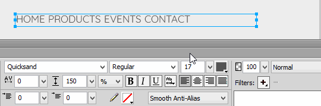

---json
{
    "title": "Design Menus with Less Hassle",
    "excerpt": "Drawing menus is easy, you need to add a few text, style and align them and it’s ready. But with this small trick it can be much easier!",
    "img": "design-menus-with-less-hassle.jpg",
    "date": "2016-12-21",
    "bgImg": "nicolas-thomas-6ko6Z5GGv14-unsplash.webp",
    "bgImgUrl": "https://unsplash.com/photos/6ko6Z5GGv14",
    "legacyURL": "https://blog.rolandtoth.hu/post/154755505937/design-menus-with-less-hassle",
    "tags": [
        "fireworks"
    ],
    "type": "post",
    "layout": "layouts/@post.njk"
}
---

The problem with the "several text chunks" menu is that you need to align items manually, styling is more cumbersome and there’s a chance you move items accidentally. To fix these, you can use only one (paragraph) text and separate entries with spaces. This isn’t particularly nice at first, but set the text alignment to "forced justify" and voila - if you resize the text, the items will be distributed evenly.



This can be a great time (and hassle) saver in the design phase where you don’t know the final width of the menu or items may be added or removed. This trick works in every major design software I tried (Fireworks, Photoshop, Illustrator, InDesign).

There’s one catch though: if you need to add spaces inside one menu item (eg. "Contact us") then it will be treated as two separate menu items. One workaround is to use another whitespace character, eg. [figure space](https://en.wikipedia.org/wiki/Figure_space) (" "):

```plaintext
HOME PRODUCTS EVENTS CONTACT US
```
