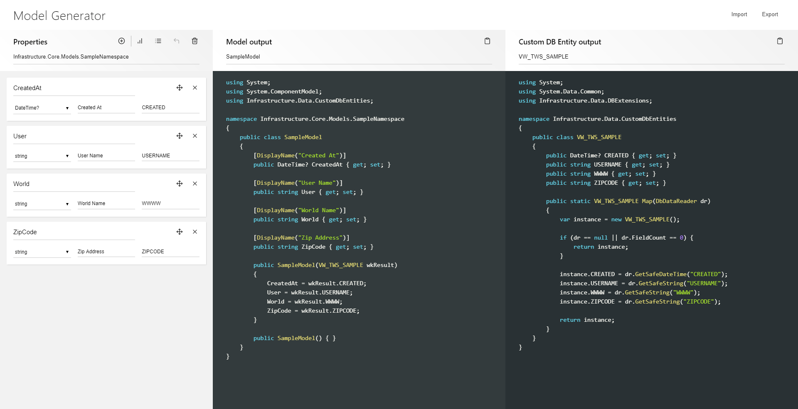

---json
{
    "title": ".NET Model Generator with Mithril",
    "excerpt": "Mithril.js is a JavaScript framework for creating client-side frontend apps or SPAs, and it's incredible for its size. I always wanted to try it out because what I read about it was very appealing. The time has come.",
    "img": "model-generator-mithril.png",
    "bgImg": "israel-palacio-ImcUkZ72oUs-unsplash.webp",
    "bgImgUrl": "https://unsplash.com/photos/ImcUkZ72oUs",
    "date": "2019-08-20",
    "tags": [
        "javascript",
        "mithril"
    ],
    "type": "post",
    "layout": "layouts/@post.njk"
}
---

I starred [Mithril](https://mithril.js.org/) on GitHub years ago but didn't have the time and project to try it out. In my [previous blog post]({{ "/dotnet-model-generator-with-eleventy/" | url }}) I mentioned that I could have used a JavaScript tool for the .NET model generator, and that was triggering Mithril in my mind. I looked up its documentation, how the project has evolved through the years, and I got more and more enthusiastic. I thought it was a perfect project to learn Mithril, and it turned out I was right.

## The application

My other motivation to rebuild the project besides learning Mithril was to provide a UI. I ended up with three columns, off which the first one is where you can input model properties. Each column's header has an input for global variables like namespace, model and custom DB entity classnames. New properties (rows) can be added via a button, or just by hitting Enter. In the top-right corner there are Export and Import buttons.

### Demo and source code

- [Demo](https://raw.githack.com/rolandtoth/MithrilModelGenerator/master/index.html)
- [GitHub repository](https://github.com/rolandtoth/MithrilModelGenerator)

## Small framework, small learning curve

After all it took me about a week to rebuild the model generator, working on the project 2-4 hours a day (after work, so not with a fresh mind). That was about the third day when my application started to work, though it took some additional iterations to complete it. Actually it could have been take smaller amount of time but I decided to do things in a "modern" way, so first I had to fill the gaps in my JavaScript/CSS knowledge as well.

I started off with this tutorial:

[https://gilbert.ghost.io/mithril-js-tutorial-1/](https://gilbert.ghost.io/mithril-js-tutorial-1/)

It was really helpful, but I needed to combine it with the official tutorial as well from here:

[https://mithril.js.org/simple-application.html](https://mithril.js.org/simple-application.html)

Both were very useful and enlightening, definitely recommended if you just begin learning the framework.

## Modules, npm, require()

I have used npm here and there but for nothing serious. Because of this, I'm a rookie in it. I made a shallow attempt to write the application in a traditional way using global variables, but fortunately I switched to modules and Webpack. This has made things easier and the code more organized, since each component, model, etc could go to a separate file.

## ES6

I forced myself in this project to use arrow functions, map(), forEach(), etc. In fact it was easier then I thought since many things were familiar to me from C#. It was nice to see how the new syntax produced more compact code, often reducing things to one or only a few lines. The two final output uses template literals, and it would have been a large PiTA if I couldn't use that.

## CSS grid and variables

CSS grid was completely unknown to me, I just read some headlines about it but since I was always had to support older browser, there was no need to learn it. Here I didn't have t worry about it, so I could use grids, and even CSS variables as well.

I started off with this online tool, which is really amazing:

[https://css-grid-layout-generator.pw/](https://css-grid-layout-generator.pw/)

It helped me grasping the basic concepts of CSS grids, although I needed to tweak the final result a bit to fit my needs.

CSS variables always appealed to me becaus they allow writing more consistent CSS, just like using variables in CSS preprocessors. I wish this feature will become much more supported soon, it's a very handy thing.

## Extra features

### Export and import

I didn't plan to add import and export features but I soon realized that it's a must if I was to create a usable tool. The core of these features were easy to implement (just save data as JSON to a file, and replace the application's main data object with the new one). But I had trouble re-populating the input fields. Finally I managed to achieve this by modifying things a bit. By the time I implemented this I had a better knowledge of how Mithril works so it was easy to refactor. That's one beauty of Mithril: by being small and having just one way to do things you can easily add new features easily.

### Input transformations

For consistency reasons I added input transformations like not allowing spaces in certain fields, or making values uppercase first or full uppercase. That was partly available in the Eleventy version as well but here I moved it to a next level.

### Checking for duplicate properties

In the Eleventy version you can add properties with the same name but here I wanted to eliminate this. If you try to type a name that already exists, the application warns you. I had to rewrite the implementation two times because at first I only checked the current input, but since each row's name could be modified anytime, all inputs should be checked all the time. That gave me a headache at first, but actually it was really easy to implement. They say Mithril is "less magic", so you have better knowledge of what's going on, and it's kinda true. But in other POV Mithril is "more magic" as it allows you to do things with a few lines of code.

## Drawbacks

It's not Mithril's fault but if you're stuck, it's often hard to find answers. Fortunately I was able to figure things out or find solution, but often my searches ended up finding examples written to older versions that were not applicable to my version (v2.0.4).

## Conclusion

I'm really happy how things came together and that I have learned many new things. In the past I could leverage Mithril a few times where I often have used messy code to do things (sometimes with jQuery). Now I have a very powerful tool under my belt for such applications and I can't wait the next one to come :)