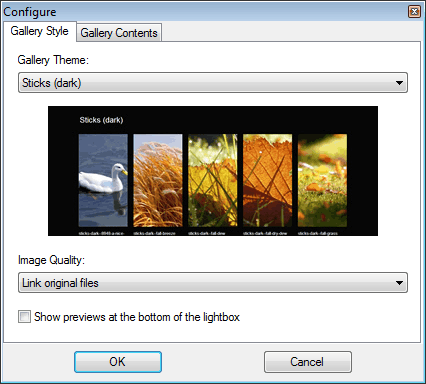

---json
{
    "title": "DropIt Galleries",
    "excerpt": "Create web galleries as easily as drag-and-drop images? DropIt makes it that simple.",
    "date": "2014-05-02",
    "img": "dropit-galleries.jpg",
    "bgImg": "claudia-aran-bJy9TI5FGeU-unsplash.webp",
    "bgImgUrl": "https://unsplash.com/photos/bJy9TI5FGeU",
    "legacyURL": "https://blog.rolandtoth.hu/post/84517434327/dropit-galleries",
    "tags": [
        "dropit"
    ],
    "type": "post",
    "layout": "layouts/@post.njk"
}
---

The idea of a gallery action in DropIt emerged about two years ago but there was always something more important to do. Finally we started to work out the details and came up with something that is easy to use and easy to develop.

## How does it work?

Just set up a new profile in DropIt for your gallery and select a theme. Then drag images to the main image of DropIt and that is all there is to it. Your new gallery is ready.

## Unique

Unlike other similar softwares, DropIt creates galleries that conform to web standards, look modern and are easy to extend. And best of all, it is free.

DropIt resizes images according to your settings and thumbnails are also resized and cropped to make size as low as possible.

## Themes

To make theming easy to maintain the markup is the same for all galleries. I made several layouts (CSS) and built the actual themes on top of them. This allows rapid development of new themes - just need to swap the layout and add a new theme CSS to stylize.

Currently DropIt has seven themes in light and dark versions. All of them are flexible width so they will look good on devices with different screen sizes.

We used fancybox for the lightbox which adapts to screen resolution so images will never go offscreen. No responsivity was built in but this may change in the future.

Some example themes:

- [Default](http://www.dropitproject.com/assets/galleries/Default_Gallery/index.html)
- [Brochure](http://www.dropitproject.com/assets/galleries/Brochure_Gallery/index.html)
- [Circles](http://www.dropitproject.com/assets/galleries/Circles_Gallery/index.html)
- [Pile](http://www.dropitproject.com/assets/galleries/Pile_Gallery/index.html)
- [SquareHeads](http://www.dropitproject.com/assets/galleries/SquareHeads_Gallery/index.html)

## Extend

Creating new themes is easy, only some CSS knowledge is needed. DropIt recognizes new themes automatically so if you have a new theme in mind it only takes a few minutes to add. If you do, please submit to us [here](http://www.lupopensuite.com/contact.htm) or drop a comment below.