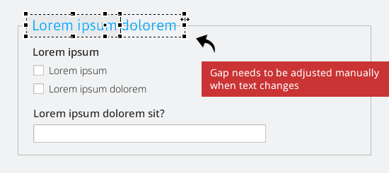
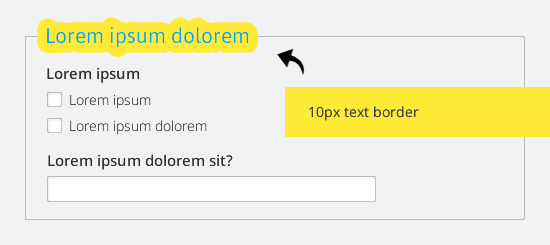
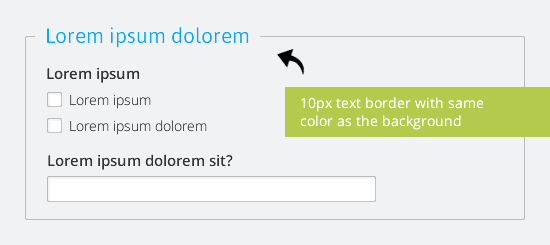

---json
{
    "title": "Easy Legends in Fireworks & Photoshop",
    "excerpt": "When designing web forms in Fireworks (or Photoshop) it is often required to draw legends. Here is a quick tip to simplify the process.",
    "img": "legend.png",
    "bgImg": "samuel-zeller-9ZcvgZGP_OY-unsplash.webp",
    "bgImgUrl": "https://unsplash.com/photos/9ZcvgZGP_OY",
    "date": "2014-07-01",
    "legacyURL": "https://blog.rolandtoth.hu/post/90480151687/easy-legends-in-fireworks-photoshop",
    "tags": [
        "fireworks",
        "photoshop"
    ],
    "type": "post",
    "layout": "layouts/@post.njk"
}
---

A legend basically consists of a bordered rectangle and some text on top of it. The rectangle should have a gap where the text appears which is hard to accomplish because neither Fireworks nor Photoshop can do such a thing automatically. A usual workflow is to put a solid rectangle below the text or masking out the bordered rectangle.

Both solutions have the same drawback: you have to adjust the gap if the length of the text changes.

## And Now For Something Completely Different

Border up! By adding a larger border size to the legend text, it should perfectly cover the bordered rectangle below.

When setting the same color for the text border as the main background color the text becomes a legend:

This way if you rewrite the text or change the size of the font, the gap will adjust automatically.

Of course you can use this technique elsewhere where a text appears on top of a line.