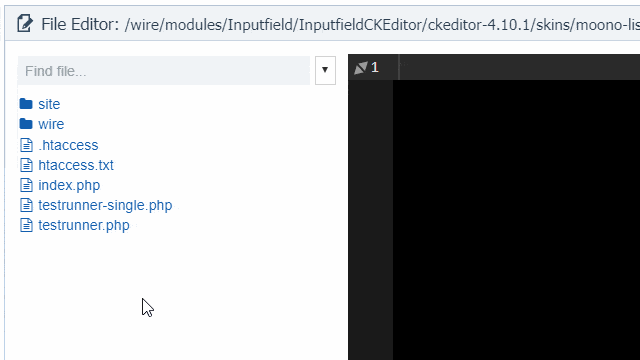

---json
{
    "title": "FilterBox: search-as-you-type utility",
    "excerpt": "In need of a pure JavaScript search-as-you type utility that can be applied on existing DOM elements? The search is over.",
    "date": "2019-07-24",
    "img": "filterbox-search-as-you-type-utility.png",
    "bgImg": "christian-fregnan-TAVKURx-xLw-unsplash.webp",
    "bgImgUrl": "https://unsplash.com/photos/TAVKURx-xLw",
    "tags": [
        "javascript"
    ],
    "type": "post",
    "layout": "layouts/@post.njk"
}
---

FilterBox makes it easy to add an input field somewhere (well, anywhere on a page) and filter items of existing DOM elements. The target can be a table, a list, even a JavaScript grid (like Kendo Grid, for example). 

## History

Well, nothing special here. Every now and then I needed such a tool and over the time I developed one that was worth converting into a utility.

The biggest milestone was when I switched the main engine to CSS. This means FilterBox doesn't modify items on filtering but only updates a stylesheet rule and the rest is done by CSS.

## Specialities

- fast CSS filtering
- no strict restrictions on the target elements
- highlight searched terms
- custom displays, eg. counters, no-result message, etc.
- key navigation: up/down arrow to select an item, and optionally do something on Enter
- various callbacks: fine tune just about everything as needed

## Used at

Apart from various projects of mine (like this very Blog) FilterBox is used on some admin pages at my workplace. Mostly they are simple filter inputs, but on one particular page it's a key feature and it's doing its job nicely for years now.

Lately it was added to [Tracy Debugger](https://github.com/adrianbj/TracyDebugger) ProcessWire module as well, allowing filtering file lists, long tables of data, etc.

In case of Tracy Debugger it took  some time to set things up properly because there were some tricky situations. For example, section titles needed to be hidden if there was no match, even though the markup was not in a hierarchical order. Fortunately the utility is flexible enough to handle such situations.

## Where it does not fit

FilterBox works with elements already on the page, even though it is possible to make it react to DOM changes. What is not possible is adding it to AJAX-loaded lists, so eg. paginated tables. In theory it would be possible with callbacks but I haven't had the need (and time) to try out.

## Demo

[View demo](https://rawcdn.githack.com/rolandtoth/FilterBox/76441a7/examples/advanced.html)

## Read more and download

[Visit FilterBox on GitHub](https://github.com/rolandtoth/FilterBox)