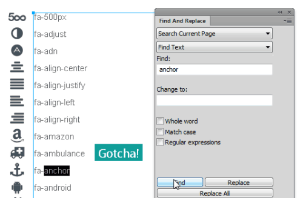

---json
{
    "title": "FontAwesome for Fireworks/Photoshop",
    "excerpt": "Do you use icon fonts in your designs or mockups? If not, you are missing a lot.",
    "date": "2014-02-13",
    "img": "fontawesome-fireworks-photoshop.png",
    "bgImg": "alexander-andrews-SjN3x8aqe-w-unsplash.webp",
    "bgImgUrl": "https://unsplash.com/photos/SjN3x8aqe-w",
    "legacyURL": "https://blog.rolandtoth.hu/post/76509872608/fontawesome-for-fireworksphotoshop",
    "tags": [
        "fireworks",
        "fontawesome",
        "photoshop"
    ],
    "type": "post",
    "layout": "layouts/@post.njk"
}
---

Web fonts made a huge impact on web design a few years ago. They are easy to use and can be used as icons too. The best of all that you can also use them in your designs and mockups.

[FontAwesome](https://fontawesome.com/) is a nice collection of icons and it is free. Having almost 400 icons at hand is probably enough for the majority of your icon needs.

## Usage

To use them you have to install FontAwesome fonts. Alternatively, you can use [Nexusfont](/nexusfont-review) or similar font loaders too.

Once the font is installed (or loaded) you can copy icons from the online [cheat sheet](https://fontawesome.com/cheatsheet/).

However, this can be a tedious work so I put them together in a Fireworks file (Photoshop file is also provided). Simply open the file and copy-paste the icon you need.

As these icons are actually characters of a font you can resize them by changing the font size or recolor by changing its color. Awesome!

## Update 2015-11-06: Searchable icons

Finding a specific icon out of hundreds is often hard so I added icon names to the file. Simply go to Edit → Find and Replace in the main menu and search for icon name, then copy the icon next to the found text.

## Download

<a href="{{ "FontAwesome-icons-FW-PSD-v4.4.0.zip" | url }}" class="button">Download</a>