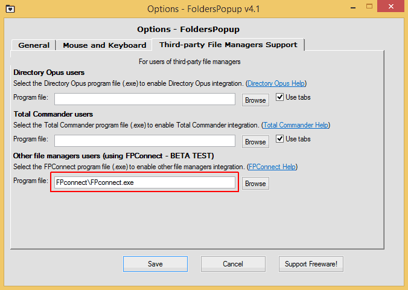

---json
{
    "title": "FPconnect for FoldersPopup (Windows)",
    "excerpt": "There are several ways to jump to favorite folders in file managers - tabs, hotdirs, keyboard shortcuts, toolbar buttons, etc. But what if you are not in your file manager? FoldersPopup is an application that can help in such situations, and the FPconnect addon allows integration of any file manager that supports commandline navigation.",
    "img": "FPconnect.png",
    "bgImg": "bryson-hammer-JZ8AHFr2aEg-unsplash.webp",
    "bgImgUrl": "https://unsplash.com/photos/JZ8AHFr2aEg",
    "date": "2014-12-15",
    "legacyURL": "http://blog.rolandtoth.hu/post/106133423662/fpconnect-for-folderspopup-windows",
    "tags": [
        "portable",
        "filemanager"
    ],
    "type": "post",
    "layout": "layouts/@post.njk"
}
---

FoldersPopup by default supports Windows Explorer plus two external file managers:

- Directory Opus
- Total Commander

These applications cover a great number of users but there are numerous other file managers. I’m currently using Double Commander which is unsupported, so I created FPconnect to overcome this.

## What is FPconnect?

FPconnect is a small utility that FoldersPopup launches instead of a file manager. Then FPconnect launches the user-specified file manager with proper commandline parameters. This way any file manager can be integrated with FoldersPopup, extending its usability.

FPconnect was tested with the following applications (not only file managers):

- [A43](https://www.softpedia.com/get/File-managers/A43.shtml)
- [Altap Salamander](https://www.altap.cz/)
- [CubicExplorer](https://sourceforge.net/projects/cubicexplorer/)
- [Directory Opus](https://www.gpsoft.com.au/)
- [Double Commander](https://doublecmd.sourceforge.io/)
- [EF Commander Free](https://www.softpedia.com/get/File-managers/EF-Commander-Free.shtml)
- [Explorer++](https://explorerplusplus.com/)
- [ExplorerXP](http://www.explorerxp.com/)
- [Everything](https://www.voidtools.com/)
- [Far Manager](https://www.farmanager.com/)
- [FreeCommander](https://freecommander.com/en/summary/)
- [IrfanView](https://www.irfanview.com/)
- [JustManager](http://justmanager.ru/)
- [MultiCommander](http://multicommander.com/)
- [Nomad.NET](http://www.nomad-net.info/)
- [Tablacus Explorer](https://tablacus.github.io/explorer_en.html)
- [Total Commander](https://www.ghisler.com/)
- [Snowbird](https://www.softpedia.com/get/System/File-Management/Snowbird-Search.shtml)
- [SpeedCommander](https://www.speedproject.de/)
- [UltraExplorer](https://www.softpedia.com/get/File-managers/UltraExplorer.shtml)
- [Unreal Commander](https://x-diesel.com/)
- [File Explorer (Windows Explorer)](https://en.wikipedia.org/wiki/File_Explorer)
- [WinNC](https://www.winnc.com/)
- [XnView](https://www.xnview.com/en/)
- [xplorer2 lite](https://www.zabkat.com/x2lite.htm)
- [XYPlorer Free](https://www.xyplorer.com/free.php)

## How to use?

FPconnect has no GUI but an ini file to edit. You have to set your file manager path and commandline parameters in FPconnect.ini.

Then you need to add FPconnect in FoldersPopup Settings and you’re ready to go.

FPconnect.ini has examples for all the application that has been tested so you only need to uncomment yours if it’s on the list. Of course you can add other applications too - if you do, please contact me so I can add it to the examples.

You can specify other type of applications besides file managers so you can use FoldersPopup for other purposes too. Again, please share if you have found new ways to use FoldersPopup.

## More info

The latest documentation and files are available at GitHub:

[https://github.com/rolandtoth/FPconnect](https://github.com/rolandtoth/FPconnect)

<a href="FPconnect.zip" class="button">Download FPconnect</a>