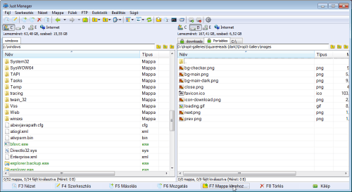
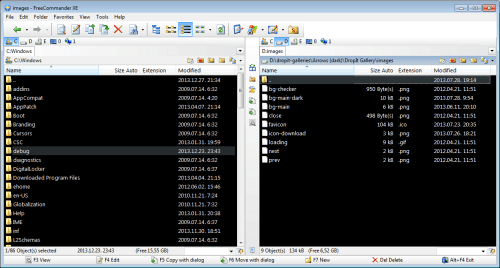
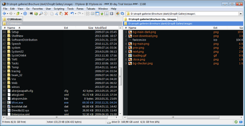
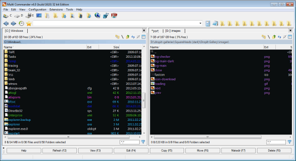
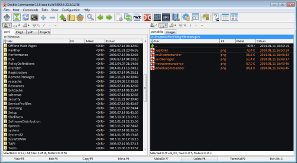

---json
{
    "title": "In Search Of The Best Free File Manager",
    "excerpt": "I tried out several free file managers to see if there’s a capable concurrent of Total Commander which is in my opinion the best of its kind. Yes, there is.",
    "img": "free-file-managers.png",
    "bgImg": "wesual-click-eXdKs9d37Sc-unsplash.webp",
    "bgImgUrl": "https://unsplash.com/photos/eXdKs9d37Sc",
    "date": "2014-05-06",
    "legacyURL": "https://blog.rolandtoth.hu/post/84705830727/in-search-of-the-best-free-file-manager",
    "tags": [
        "filemanager",
        "doublecommander",
        "portable",
        "totalcommander"
    ],
    "type": "post",
    "layout": "layouts/@post.njk"
}
---

## My Preferences

- two file panels
- NC-style selection
- custom (portable) file associations
- custom context menu
- rich customization (custom file icons, dark background and light file colors, etc.)
- portable version
- no dependencies (.NET, Java, etc.)
- free
- multilanguage (including Hungarian) - optional

I was determined to allow certain compromises as I was looking for a free alternative for a commercial application.

## Just Manager (v0.1 alpha 52)

[http://justmanager.ru/](http://justmanager.ru/)

This is the first in the list because I like it very much even though it is a simple one. I use it rarely on my machine but I installed it on other machines and it performs well. Just Manager is like an essence of Total Commander with the right settings checked out of the box. However, its features are limited so in its current state it does not fit for my needs. On the other hand I install it on computers where only minimal file management is needed.

### Pros

- small and logical
- easy to customize

### Cons

- missing features: portable file associations, archive support, etc.

## FreeCommander XE (v2014 build 650)

[http://www.freecommander.com/fc_beta_en.htm](http://www.freecommander.com/fc_beta_en.htm)

FreeCommander XE almost made it through but I found it a bit slow on listing/scrolling directories. The lack of custom right-click menu items was also an issue for me.

### Pros

- feature-rich

### Cons

- slow directory listing and scrolling
- no custom right-click menu item support

## XYplorerFree (v13.60)

[http://www.xyplorer.com/free.php](http://www.xyplorer.com/free.php)

XYplorerFree has many nice features that cannot be found elsewhere but the free version does not have all of them. I tested the trial version of the Pro version because I could get a free license with providing a Hungarian translation. However, I haven’t choosed that path because I found the application a little overcomplicated. Perhaps I should have spent more time on it but XYplorer was simply too much for me. The application reminded me of Directory Opus which is also very powerful but too complicated (again, for me).

### Pros

- professional ecosystem of features

### Cons

- no portable file associations & icons 
- no NC-style selection
- no Hungarian language (yet?)

## Multi Commander (v4.0 build 1610)

[http://multicommander.com/](http://multicommander.com/)

Multi Commander was the first one where I felt that it might fulfill my needs. I could set up portable file associations easily and customized the way I liked (well, almost). I had issues with the toolbar placement and customization is a little PitA. The look of the application needs further improvements as it feels a little odd, though that’s the smallest issue I guess. Overall, Multi Commander can be a good choice as it is rapidly developed so these issues might be fixed soon.

### Pros

- feature-rich, highly customizable

### Cons

- unusual customization panels
- no custom right-click menu

## Double Commander (v0.6 beta)

[http://doublecmd.sourceforge.net/](http://doublecmd.sourceforge.net/)

I almost forgot about this one but fortunately I haven’t. I dare to say Double Commander is the best choice for someone coming from Total Commander. It has almost the same feature set as TC which is probably well enough for the average user, including me. As you might guess, that was the winner for me.

This was the only application where I could set a dark theme without sacrifying anything (besides TC). Its internal file associations is at least as good as in TC.

### Pros

- feature-rich, highly customizable

### Cons

- custom right click menu items are nested in an “Actions” submenu
- rename on slow double click is unavailable (_update 2019: it's been added since then_)
- minor cosmetic issues: line-height is not adjustable, white flash on changing tabs, etc.

## Conclusion

I know it is unfair comparing a commercial application with a free one but I hope my experiments help you finding the best file manager for you.

## Update 2019

I'm still using Double Commander as my default file manager. It's doing its job nicely, at my home computer and at work as well. It is still developed, every few days I check the [changelog](https://doublecmd.sourceforge.io/snapshots/changelog.txt) and try out the beta version if there's something catching my eye.