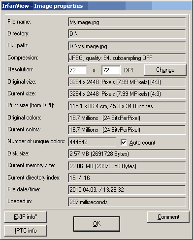
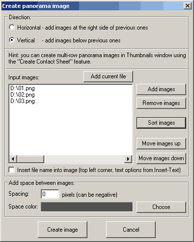
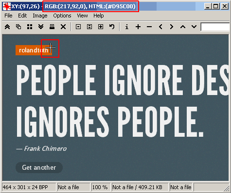
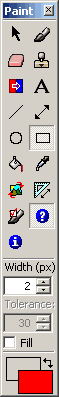
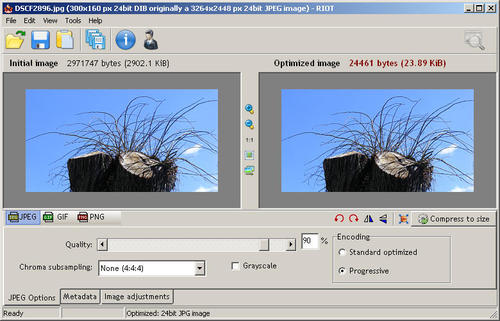
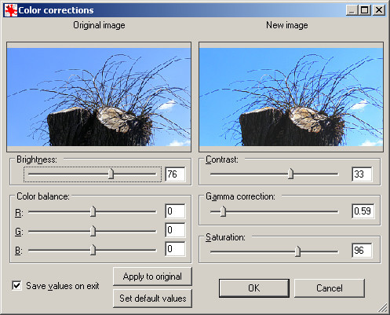
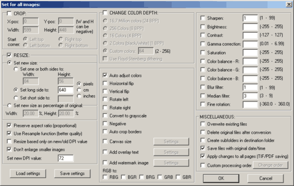

---json
{
    "title": "IrfanView Time-Saving Techniques (Windows)",
    "excerpt": "If you are on Windows, IrfanView is possibly the best choice for viewing images and making simple edits. Here are some useful features that can you save time and effort.",
    "img": "irfanview-time-saving-techniques-windows.png",
    "bgImg": "stanislaw-gregor-4V_3E3jhZQ0-unsplash.webp",
    "bgImgUrl": "https://unsplash.com/photos/4V_3E3jhZQ0",
    "date": "2012-08-26",
    "legacyURL": "http://blog.rolandtoth.hu/post/33155903713/irfanview-time-saving-techniques-windows",
    "tags": [
        "irfanview",
        "software"
    ],
    "type": "post",
    "layout": "layouts/@post.njk"
}
---

## Quick Image Information

This is ridiculously simple: load an image and hit ```i```. The most basic image information will be shown. If the image has EXIF data or IPTC info, there will be additional buttons in the bottom left corner.



## Paste Special

Latest version of IrfanView can paste images on clipboard to the right/left/bottom/top of the loaded image. This comes handy if you need to put images of the same sizes next to each other.

If you need to assemble multiple images, go to **Image -> Create Panorama image**. There you can put specify more options and load more than one images at a time.



## Making Screenshots

IrfanView is able to make screenshots too (**Options -> Capture/Screenshot**, default shortcut C). This is not the most sophisticated screenshot application but for me 99% of the cases it is well enough. I have my PrintScreen button programmed to make a screenshot with IrfanView (using PowerPro):

```plaintext
"D:\IrfanView\i_view32.exe" /capture=0
```

This will open IrfanView loaded with the image of the desktop area. Using ```/capture=2``` will capture the client area of the active window, that is, only a dialog box or the active window without windows underneath.

## Grabbing Screen Color

If you click and hold on a pixel in IrfanView title bar of the application shows the RGB and HEX value of the pixel’s color. Neat, huh? Furthermore, holding Shift will copy the HEX value to the clipboard (without the hash character).

I use it very often when converting a psd to html, together with the screenshot feature described above. You can zoom in by making a selection and clicking in the middle. I tried several color grabber applications but none of them allowed such a convenient workflow.



_Tip: disable resample feature in IrfanView to avoid blurring when zooming. To do this, uncheck **View -> Display options (window mode) -> Use "Resample"**._

## Paint Dialog

Adding simple shapes or texts is also available in IrfanView. **Go to Edit -> Show Paint** dialog or hit ```F12``` and a new toolbar will appear on the right side. Tools here are about as complex as in MS Paint but they are useful for adding callouts, highlights to screenshots, etc.



## Cropping Images

Select an area in IrfanView and hit ctrl+Y to remove image parts outside. Watch the title bar to see the dimensions of the selection. If you need more precise control of the selection (e.g. exactly 485 x 320 pixels) then use shift+C and add these values. This feature remembers previous settings so if you load another image you can crop it by exactly the same dimensions (and image offset).

It works the other way too: if you make a selection and hit shift+C, you can click on "Save values and exit". This will do nothing but saves the actual selection’s dimensions to make it available for the next time. Great for screenshots that needs the same area of the desktop (or window).

Sometimes you need to get rid of the white area of an image. You can remove it easily by hitting ```ctrl + shift + y``` (**Edit -> Auto crop borders**).

## Precise Selections

Selecting image area by the mouse is sometimes frustrating. Hit ```ctrl + a``` to select the entire image, then you can modify the selection by using

- **ctrl + arrows**: expanding or decreasing selection size (keeping aspect ratio)
- **alt + arrows**: adding or removing 1 pixel at a time from the corresponding side of the image
- **shift + arrows**: moving the selection by 1 pixel at a time

Of course, you can always move selection’s border with the mouse.

To move the entire selection, hold down the right mouse button inside the selection and drag it.

In **Edit -> Show selection** grid you can set selection style to show Golden Ration or Thirds. This is useful when cropping images to center content.

## Save For Web

IrfanView comes with the lite version of the RIOT plugin (Radical Image Optimization Tool) but you can - and should - download the [extended version](https://riot-optimizer.com/download/) as it offers extra functionality.

Place the Riot.dll to the Plugins directory and FreeImage.dll to the root directory of IrfanView (comes with the plugin).

Now if you need to save an image in JPG, GIF or PNG formats, go to **File -> Save for Web… (PlugIn)**, and you will have more control of the outcome (size of the optimized image, visual preview, etc).



_Tip: to preserve transparency go to the RIOT Options (**Tools -> Options**), and check **Import ancillary data from original file** on the second tab. Doing so the plugin’s window will have additional tabs in the bottom. Click on the **Mask** tab and check the **Keep transparency**. Note that this tab is available only for transparent images._

IrfanView has an option **JPG Lossless Rotation**, available from the Options menu, or ```shift + j```. Use this if you need to rotate a jpg file instead of re-saving to avoid quality loss.

## Color Adjustments

IrfanView is not designed to be the next Photoshop but you can perform simple color corrections. Hit shift+G for Color Corrections or shift+U to auto adjust colors. Though this feature is no way professional I use them frequently to see if the design looks better with some extra contrast or gamma correction, etc.



Adjustments work on selections too, so you can make a quick before & after preview by selecting half the image and applying some color adjustment for example.

## Batch Operations

One of the best features of IrfanView is that it supports batch processing of images. Almost all features can be used in batch, making it a very powerful tool. I mainly use batch features for resizing images but if you look at the advanced batch dialog you can see how versatile it is:



You can also save batch settings for future use.

__Tip: using DropIt you can save even more time by creating profiles for repetitive tasks. Check this [blog post](https://dropitblog.wordpress.com/2011/11/14/line-up-with-command-line/) for using DropIt with IrfanView, or another post on how to remove EXIF data from images [here](https://dropitblog.wordpress.com/2012/07/15/remove-exif-data-from-images/).__

## Thumbnails

Hitting ```t``` will toggle IrfanView Thumbnails. This feature is not so sophisticated but you can select multiple images here and apply various operations on them. Use the right-click context menu or the File menu to access these features.

## Conclusion

As you can see IrfanView is a designer’s best friend when it comes to viewing images or making smaller modifications. Knowing how to use can save you lot of time.

## Your turn

Do you know more time-saving techniques for IrfanView? Please post them in the comments! 
