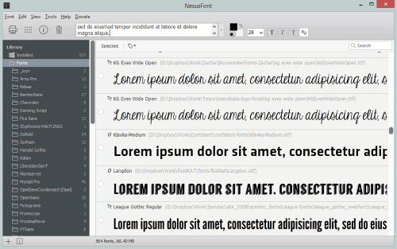

---json
{
    "title": "Let the Fonts Be with You: NexusFont (Windows)",
    "excerpt": "Whether your are a print or a web designer, you need fonts. The freeware NexusFont font viewer/manager is an excellent tool to set up a convenient font management system.",
    "date": "2012-07-11",
    "img": "nexusfont-windows.png",
    "bgImg": "taner-ardali-wAoA4WkiDeo-unsplash.webp",
    "bgImgUrl": "https://unsplash.com/photos/wAoA4WkiDeo",
    "legacyURL": "https://blog.rolandtoth.hu/post/33152691099/nexusfont-review",
    "tags": [
        "portable",
        "software"
    ],
    "type": "post",
    "layout": "layouts/@post.njk"
}
---

## Load, not install

Unless you have a CI to adapt, you might try dozens of fonts until you find the best for the job. Instead of installing you can use NexusFont font manager to activate (load) fonts to the system. This means that loaded fonts will be available for use in other programs too.



## Keep it clean

What's even better, you can create font groups so you can load/unload them when needed. I usually create a ```{projectName}-fonts``` directory in my project folder and copy fonts there that I would like to use or try. This way the system is not messed up with unnecessary fonts plus I can take control of my font sets. Back to a project months or years later? No problem, drag-and-drop fonts to NexusFont and I'm good to go.

You can set NexusFont to sit in the system tray when minimized so it won't be in the way when not needed.

## Keep it portable

NexusFont is available in install and portable versions for Windows. You can even carry your fonts with you with the latter - a must have tool!

## Download

You can download NexusFont from its [home page](http://www.xiles.net/).