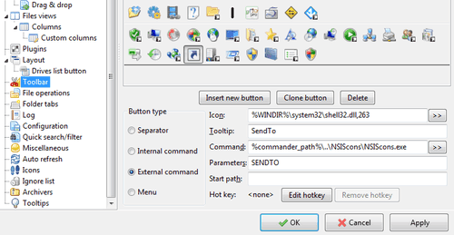
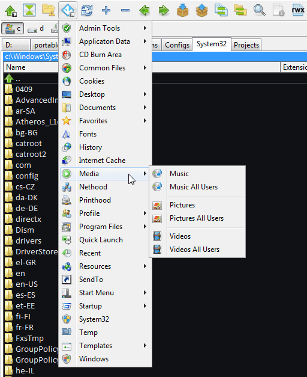

---json
{
    "title": "NSIScons (Windows)",
    "excerpt": "NSIScons is a small tool that puts buttons to Total Commander’s / Double Commander’s button bar to navigate quickly to system locations. It supports about 50 pre-defined constants to make it really easy to jump anywhere you might want to.",
    "img": "nsiscons.png",
    "bgImg": "robert-zunikoff--yz22gsqAH0-unsplash.webp",
    "bgImgUrl": "https://unsplash.com/photos/-yz22gsqAH0",
    "date": "2014-06-01",
    "legacyURL": "http://blog.rolandtoth.hu/post/87499883652/nsiscons-windows",
    "tags": [
        "doublecommander",
        "totalcommander"
    ],
    "type": "post",
    "layout": "layouts/@post.njk"
}
---

NSIScons is in fact around since 2011 when I released the very first version. Originally it supported Total Commander only as that was my main file manager at the time. I switched to Double Commander months ago and unfortunately NSIScons was not compatible. I really missed it and finally decided to release an update. Luckily it was easy to change the code to support both file managers.

## How does it work?

The application simply launches TC or DC with a commandline parameter. For example

```ini
NSIScons.exe SENDTO
```

runs TC or DC opened with a panel navigated to

```ini
C:\Users\[USERNAME]\AppData\Roaming\Microsoft\Windows\SendTo\ 
```



Because NSIS handles paths, system-related variables are automatically resolved. So you don’t need to deal with USERNAME in paths and everything should work fine on localized Windows boxes.

## What’s new?

From v0.2 NSIScons can be used also with Double Commander. What’s more, there is a copy-paste example in the downloadable package so you can add a menu to the toolbar in a few seconds. The example uses Windows system icons so it looks something like this:



Version 0.2 also supports environment variables.

## Download

<a href="nsiscons-v0.2.zip" class="button">Download NSIScons v0.2</a>

_Icons are designed by [Yathosho](http://forums.winamp.com/showthread.php?t=276366)_