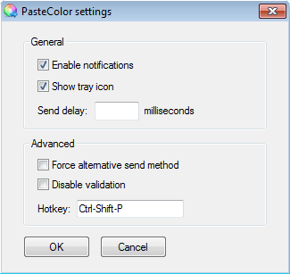

---json
{
    "title": "PasteColor: Copy Paste Tool for Windows Color Pickers",
    "excerpt": "Started this project about half a year ago and a few days ago I released PasteColor, a Windows utility which makes it easy to copy and paste colors from the built-in Windows color picker. Sounds like a success story, isn’t it? Well, not so fast.",
    "img": "pastecolor-copy-paste-tool-for-windows.png",
    "date": "2013-04-26",
    "bgImg": "efe-kurnaz-RnCPiXixooY-unsplash.webp",
    "bgImgUrl": "https://unsplash.com/photos/RnCPiXixooY",
    "legacyURL": "https://blog.rolandtoth.hu/post/48947686821/pastecolor-copy-paste-tool-for-windows-color",
    "tags": [
        "portable",
        "utility",
        "windows"
    ],
    "type": "post",
    "layout": "layouts/@post.njk"
}
---

PasteColor is a "copy paste tool for Windows color pickers" as I officially defined. You probably know the situation when you know a color code (e.g. #924519) and would like to paste it into the Windows color picker. Yes, you can’t, as there is no input box for that. You have to find out the RGB values and type the 0-255 numbers MANUALLY into the corresponding red-green-blue fields (yikes!). Provided if your memory serves you well.

This is where PasteColor steps in. It adds an input box where you can enter the color code and it will be converted and pasted into the right fields "automagically". Copying color codes is also just as easy - entering "copy", "rgb" or "hex" will copy the color in the proper formats.

From time to time I have some dirty projects where I have to use MS Word and PowerPoint. I was searching for such a tool but as it turned out there was none. (Well, Jovian Color Picker comes close but it is payware). Can you believe this is real in 2013? That was when the idea of PasteColor was born. Seemed an easy task but…

## Getting into Trouble

The first version was soon set up and working. Unfortunately I made the mistake not testing on Windows 7 and it turned out that there was a major issue that caused malfunction. So I had to take it off and started to examine.

Unfortunately that was not something that I could easily track down. In fact I was not able at all. The way PasteColor worked was simply "incompatible" with Win7. I parked the project and did not look at it for months. 

## Getting out of Trouble

As I was not able to fix the issue I almost forgot the project. Then the idea came to modify its main behavior - that is, make it always run in the background instead of launching with a hotkey.

That was the turning point. The core issue was eliminated but some others were raised. The most challenging of them was to create a graphical interface.

## Making the GUI

I have made some tools with scripting languages but this was the first time to create a GUI. Actually it was rather a challenge than a burden. Finally I came up with a settings window and a tray menu for PasteColor. Of course, AutoIt makes it relatively easy to do such things but for a newbie like me it is a big achievement. Being able to create my own simple GUI applications is just great!

If you happen to look for a tool to copy or paste color codes in the Windows color picker, give PasteColor a try.

## Learn more

You can read the documentation and download from here: [PasteColor](http://pastecolor.rolandtoth.hu/)