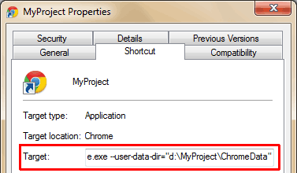

---json
{
    "title": "Per Project Chrome Instances",
    "excerpt": "Developing websites involves using many web applications, development/live servers, database admins, etc. where you need to login with different credentials. But jumping between accounts and finding the right URLs are frustrating. Wouldn’t be life easier if you could launch your browser with a working set of sites tailored to the actual project? With the help of profiles, you can.",
    "date": "2013-09-14",
    "img": "per-project-chrome-instances.png",
    "bgImg": "photo-1495976797530-f33e6580e44b.webp",
    "bgImgUrl": "https://unsplash.com/photos/k9e4KXs6AGQ",
    "legacyURL": "https://blog.rolandtoth.hu/post/61202386954/per-project-chrome-instances",
    "tags": [
        "chrome",
        "projectmanagement"
    ],
    "type": "post",
    "layout": "layouts/@post.njk"
}
---

## User-Data-Dir: Same Browser, Different Settings

By launching Chrome with custom data directories you basically start new instances of the browser. Each will remember its history, bookmarks, passwords, etc. Data directories behave as sandboxes so no information is shared between the profiles.

Use the commandline switch

```plaintext
–user-data-dir=PATH_TO_DIR
```

and Chrome will use the specified directory to store settings.

For example, using

```plaintext
Chrome.exe –user-data-dir="d:\MyProject\ChromeData"
```

will save settings to "d:\MyProject\ChromeData".

To start Chrome with commandline switches, you can:

- use a launcher application (I prefer [Executor](http://executor.dk/) but there are tons to choose from)
- create a shortcut (eg. on Desktop) and edit the "Target" field (mind the quotes):

```plaintext
"C:\Users\userid\AppData\Local\Google\Chrome\Application\Chrome.exe" –user-data-dir="D:\MyProject\ChromeData"
```



## Safe and Flexible

The data directory can be on an different path then Chrome itself. That means if you uninstall Chrome or other bad thing happens your data directories will remain intact. To ensure this, place your data directories to different partitions than your Chrome installation.

If you ever need to change the data-dir location, simply move the directory and adjust the commandline parameter.

## Customize

Now that you have separated data directories you can start customize them to make things easier.

- Put sites that are connected with the current project on the Bookmark bar to quick access.
- Login to sites you will use when working on the given project. Allow Chrome remember usernames/passwords (unless you use another way to store passwords).
- Customize Chrome settings, e.g. start with tabs from previous session, disable translation feature, etc.
- Apply a color theme that fits the best for the project. This way you can easily recognize which project the current Chrome instance belongs to.
- You can use other commandline parameters with Chrome, for example to always start in incognito mode, set custom cache dir, etc. See the complete list [here](https://peter.sh/experiments/chromium-command-line-switches/).

## What About the Multi-User Feature?

The built-in multi-user feature is similar but I found that less flexible than custom data directories. You don’t have control over data directory locations and you cannot start Chrome with a specified user (the previous is loaded automatically). Using “–user-data-dir” completely isolates your Chrome instances and does not mess with the multi-user feature.

## Final Words

Using Chrome with custom data directories per project is a great time-saver. I bet even Chuck Norris is using them too :)