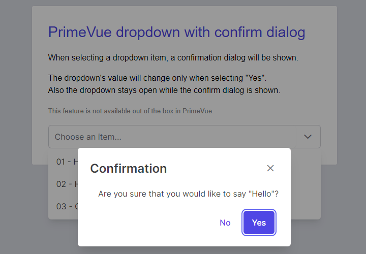

---json
{
    "title": "Vue PrimeVue dropdown with confirm",
    "excerpt": "There is no confirm feature on PrimeVue dropdown when selecting an item, but with the following workaround it's easy to add.",
    "img": "primevue-dropdown-with-confirm.png",
    "date": "2022-02-06",
    "tags": [
        "vue",
        "primevue"
    ],
    "type": "post",
    "layout": "layouts/@post.njk"
}
---

I needed a confirm dialog in my latest project and sadly realized that there is no such feature in PrimeVue's Dropdown component. Before starting to redesign that part of the application I gave it a go to fix this.

I googled for a possible solution a bit but found nothing. Then I remembered from the past that in such situations overriding the given method and then re-setting is one way to deal with such issues. Ultimately this worked here too.

## Demo

[https://stackblitz.com/edit/vue-primevue-dropdown-with-confirm](https://stackblitz.com/edit/vue-primevue-dropdown-with-confirm)

## Breaking it down

What's happening here is that when the user clicks on a dropdown item, dropdown's `hide()` method is saved to a temporary variable and then it's set to `undefined` (that, is, nulled). This stops PrimeVue to close the dropdown, so it stays open while the confirm dialog is opened.

Of course this wouldn't stop the dropdown to set the clicked item as the selected option. To overcome this, I manually set the `selectedOption` to the dropdown's `modelValue` property, which is still containing the old value. So at this point the dropdown is opened and its value is latest selected option, not the new one the user cicked on.

Then the confirm dialog opens which has two outcomes: "accept" or "reject". In the "accept" part the `selectedOption` is set to `event.value`, which is the actually selected option from the user. Additionally the `hide()` method needs to be restored on the dropdown in both parts, which is as easy as assigning the previously saved method to the dropdown.

# Summary

This is an easy and painless fix for this issue. However, I think such feature should be baked into PrimeVue (and PrimeNG, PrimeReact, etc), as this would come really handy in many situations.

