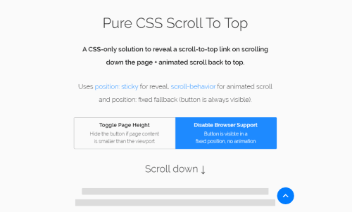

---json
{
    "title": "Pure CSS scroll-to-top",
    "excerpt": "Given all the tools CSS offers I always wondered whether it was possible to make a scroll to top link functionality via CSS only. After many unsuccessful attempts the idea came in to try with position: sticky which finally began to work.",
    "date": "2018-04-16",
    "img": "pure-css-scroll-to-top.png",
    "bgImg": "alessia-cocconi-zLIUdGeKxv0-unsplash.webp",
    "bgImgUrl": "https://unsplash.com/photos/zLIUdGeKxv0",
    "legacyURL": "http://blog.rolandtoth.hu/post/173002953922/pure-css-scroll-to-top",
    "tags": [
        "css"
    ],
    "type": "post",
    "layout": "layouts/@post.njk"
}
---

Using position: sticky alone wouldn’t solve the issue, I had to add an absolutely positioned wrapper and utilizing transform and viewport height (vh) units to reveal the link after scrolling down the page.

There were several iterations until everything played nicely together. Now it works as intended on capable browsers and shows up in fixed position in older ones, which sounds as an acceptable compromise to me.

Animated scroll was achieved using the relatively new scroll-behavior: smooth CSS property and falls back to simple jump to top if it’s not supported. I think it’s a fair trade-off because the main functionality is preserved, although less fancy. Even so it’s much more CPU friendly adding an event listener to the link rather than calculating the actual top offset on each scroll (plus on doc ready, window resize, etc).

## Demo

[https://codepen.io/rolandtoth/full/eMamVK/](https://codepen.io/rolandtoth/full/eMamVK/)

Although it may look like a minor thing it really made my day and it’s amazing how far you can go with CSS only.