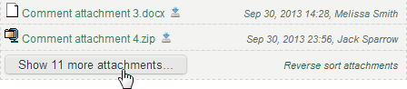
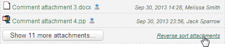

---json
{
    "title": "qdPM Attachment List Addon",
    "excerpt": "qdPM is a web based project management tool written in PHP that comes in free and paid flavors. Since I’m more used to Redmine I miss the attachment list feature above the comments. Attachments are scattered in the comment flow which makes hard keeping track of them, especially when a project grows large. The problem can be easily solved by adding an extra piece of JavaScript.",
    "date": "2013-10-04",
    "img": "qdpm-attachmentsHelper.png",
    "bgImg": "brazil-topno-HtMIOJIe4eQ-unsplash.webp",
    "bgImgUrl": "https://unsplash.com/photos/HtMIOJIe4eQ",
    "legacyURL": "https://blog.rolandtoth.hu/post/63105934576/qdpm-attachment-list-addon",
    "tags": [
        "javascript"
    ],
    "type": "post",
    "layout": "layouts/@post.njk"
}
---

## jQuery to the Rescue - attachmentsHelper.js

What attachmentsHelper.js does is simply walk through comments and if an attachment is found then clone it to the top. It also appends the uploader name and upload time.

I applied different styling to separate them from the attachments in the Task details. To make it more compact I made the "view" link hidden.

## How to install

### Step 1

Copy attachmentsHelper.js to **qdpm\js\helpers** directory. If you have the Extended version use "qdPMExtended" in the path instead of "qdpm".

### Step 2

Add these lines after `<?php echo stylesheet_tag("common.css") ?>` in **qdpm\core\apps\qdPM\templates\layout.php**:

```php
<!-- attachmentsHelper -->
<?php
    echo javascript_include_tag("/js/helpers/attachmentsHelper.js");
?>
<script type="text/javascript">
    $(document).ready(function() {
        $.fn.attachmentsHelper({
            language: "<?php echo $sf_user->getCulture(); ?>",
            maxVisibleAttachments: 5
        });
    });
</script>
<!-- /attachmentsHelper -->
```

That’s all, attachmentsHelper should work from now on. To deactivate, simply comment out the code you added in Step 2. Make sure to repeat these steps after upgrading qdPM.

Feel free to use attachmentsHelper.js and modify it to your needs if needed. Don’t forget to drop a line here if you make any improvements to it.

Please note that I am not connected with qdPM.

### Update 2013/11/16

**v0.3:** New install code, localization support

- new install code (allows adding global settings)
- localization support: attachmentsHelper shows up in user language set in qdPM profile (reverts to English if language is unavailable)
- maximum number of visible attachments can be set globally using "maxVisibleAttachments"
- minor fixes

Currently attachmentsHelper supports English, German, Hungarian, Russian, Serbian and Swedish locales. Please help by submitting new languages by translating these strings:

- showAll
- more
- collapseList
- reverseSort

### Update 2013/10/12

**v0.2:** Limit Number of Visible Attachments & Modify Sort Order

Version 0.2 of attachmentsHelper displays only 5 attachments in the list and hides the rest. You can use the "Show X more attachments" button to reveal all.



To change the default value, modify this line:

```javascript
var maxVisibleAttachments = 5;
```

Set this number to a very high value (e.g. 9999) to disable this feature.

By default, attachments are listed by date ascending. This can be changed by clicking on the "Reverse sort attachments" link in the bottom right corner of the attachment list block. This setting is saved in a cookie so it will persist until cookies are deleted.



## Download

[Download attachmentsHelper](attachmentsHelper.zip)