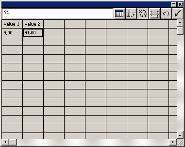
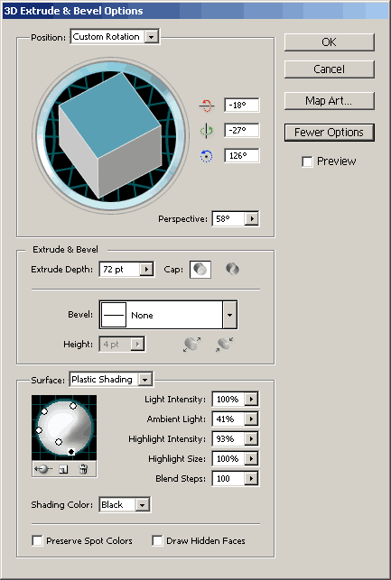
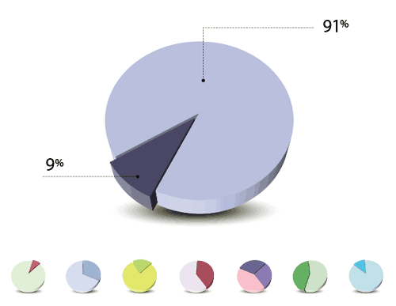

---json
{
    "title": "Reusable Pie Chart in Illustrator",
    "excerpt": "Recently I needed to create several pie charts for a presentation. I knew that in Illustrator it is possible to create eye-catching ones by adding the input data so I gave it a try.",
    "date": "2012-07-11",
    "img": "reusable-pie-chart-in-illustrator.png",
    "bgImg": "samuel-zeller-j0g8taxHZa0-unsplash.webp",
    "bgImgUrl": "https://unsplash.com/photos/j0g8taxHZa0",
    "legacyURL": "https://blog.rolandtoth.hu/post/33155232218/reusable-pie-chart-in-illustrator",
    "tags": [
        "download",
        "illustrator",
        "tutorial"
    ],
    "type": "post",
    "layout": "layouts/@post.njk"
}
---

## The Goals

- **Parametric**: ability to modify the input numbers to make it reusable
- **Recolorable**: ability to add unique colors to the slices

## Quick How-To

### Step 01

Select the **Pie Graph** tool from the Tools palette. The default shortcut is J, but you have to click and hold the tool’s button to select first. Draw an area on the artboard with the tool. This area will be the final size of the chart.

### Step 02

In the pop-up spreadsheet-like dialog enter ```Value 1``` in the first cell, and ```9``` the cell below.

### Step 03

Enter ```Value 2``` in the second cell of the first row, and ```91``` in the second cell of the second row.

### Step 04

Click on the **Tick** icon in the top-right corner to Apply. Close the dialog (click Yes if it asks whether to save data).



### Step 05

You will notice that Illustrator adds the legend by default. To modify it, right-click on the graph and select **Type…** from the menu. Under the Options section, select **No Legend**.

### Step 06

Now add some 3D look. Select the chart and go to **Effect -> 3D -> Extrude & Bevel**. I used ```-18```, ```-27``` and ```126``` degrees for the custom rotation, with ```58``` degrees of perspectiv and ```72``` pts for the extrude depth. No bevel was used and the default plastic shading was applied.

### Step 07

To make your chart shine, click on **More options** in the **Extrude & Bevel** dialog and add more lights. Here you can see my settings:



### Step 08

Remove the chart’s outline and assign custom colors to the slices by selecting them with the **Direct Selection Tool** (default shortcut A).

### Step 09

To make a slice stand out a bit, use the **Direct Selection Tool** and move the slice a little away from the chart.

### Step 10

Use the **Rotate Tool** (default shortcut R) to rotate the chart if needed.

Add some fancy shadow and your chart is ready. I used an ellipse with radial gradient fill (going from transparent black to opaque black). If you are making several charts it is recommended to turn the shadow into a symbol so you can modify it easier later if you wish.

## Making More Charts

Alt+drag a chart to make a duplicate. Right-click on it and select **Data…**, then modify the values according to your needs. Make sure the sum adds up to 100, that is, 100%. You can add more columns if you need more slices.

Use the **Direct Selection Tool** to arrange the slices and to assign new colors, and rotate the chart if needed. You may need to modify the 3D rotation settings (select the chart and go to the **Appearance panel** and click on the **3D Rotate & Bevel** item).

If all went fine, you could end up with such beautiful pies:



## Download

You can download the Illustrator CS4 file [here](reusable-pie-chart-in-illustrator.zip).