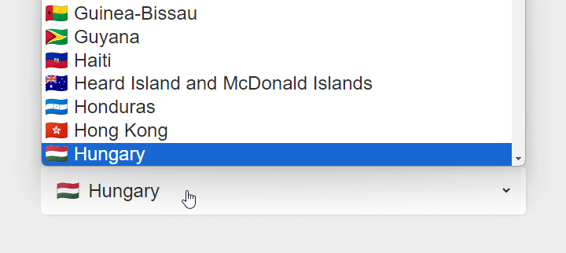

---json
{
    "title": "Unicode country flags",
    "excerpt": "Easy way to use country flags in your projects, with a twist because of Windows.",
    "date": "2024-12-23",
    "img": "unicode-country-flags.png",
    "tags": [
        "icon-font"
    ],
    "type": "post",
    "layout": "layouts/@post.njk"
}
---

## The problem

When implementing eg. a country selector dropdown, either manually or via a UI library, it's a hard decision how to add country flags to it. One way is to load them as images, but that means many HTTP requests - over 200 just for this feature.

Another way is to use a sprite, which reduces requests to only one. I've used Freak Flags in the past and it served pretty well:

[Freak Flags](https://www.freakflagsprite.com/)

The only issue I have with it that it's pixel-based and sometimes hard to style it, but overall I can't complain too much.

## Looking for Unicode

Lately I've found out that world flags are available also as unicode characters. I thought it will be a piece of cake to use them, but it turned out that there's a blocking issue on Windows as there is no default font installed that could display them properly.

## [Yes to] Noto Color Emoji

After a quick search the Noto Color Emoji font seemed to be able to bridge this gap:

[Noto Color Emoji @ Google Fonts](https://fonts.google.com/noto/specimen/Noto+Color+Emoji)

And indeed, icons started to appear on my Windows machine too, instead of eg. the "IT" icon combo instead of the Italian flag.

There was one issue though: the font size was a bit heavy, with several megabytes altogether when using directly as it came from Google Fonts. Investigating it a bit I found out that the font loads item categories as several font chunks, one being the world flags there. The demo below uses the icon only for the flags, which is still almost 700KB large. For me it's an acceptable size for vector-based flags, but of course, it depends on the project.

## Demo

I've used [https://flagpedia.net/emoji](https://flagpedia.net/emoji) site to grab icon codes and country names to put together this demo (and a pinch of Copilot):

[https://codepen.io/rolandtoth/pen/XJrRNaM](https://codepen.io/rolandtoth/pen/XJrRNaM)

## Conclusion

Not too much to conclude here, but if you prefer vector-based country flags, this unicode solution is a simple and easy one.
