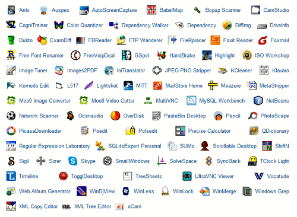

---json
{
    "title": "yaP: yet another Portablizer",
    "excerpt": "DIY style launcher for creating portable applications on Windows.",
    "img": "yap-yet-another-portablizer.jpg",
    "bgImg": "eskil-helgesen-gSTQVK7PReg-unsplash.webp",
    "bgImgUrl": "https://unsplash.com/photos/gSTQVK7PReg",
    "date": "2013-06-01",
    "legacyURL": "https://blog.rolandtoth.hu/post/51885465282/yap-yet-another-portablizer",
    "tags": [
        "portable",
        "utility"
    ],
    "type": "post",
    "layout": "layouts/@post.njk"
}
---

I love portable applications. They simplify my life not having to install and customize my favorite applications after OS reinstalls and I can use them on another PCs, etc. Trying out different launchers and building many during the years I developed yaP: a universal do-it-yourself style portable launcher.

I have built a lot of portables using NSIS (better saying, wrappers for applications to make them behave portably). After some time I realized there is too much repetitive work in it and often only a little tweak is needed to make a new portable. For example, saving and restoring a registry key, or copying an ini file to Application Data, etc. First I thought I could create a multi-purpose portable application template but that would have require NSIS to compile. So I decided to make a ready-built launcher that reads settings from an ini file instead, and executes batch files that does the hard work.

That is how yaP - yet another Portablizer was born back in 2009. I released it on The Portable Freeware Collection [forum](https://www.portablefreeware.com/forums/viewtopic.php?f=11&t=5698). Everything went fine until I added more and more new features and new operating systems (Win7 and Win8) stepped in. People started reporting strange issues that I could not fix easily so finally I decided to make a complete rewrite.

## Rewrites

First I rewrote it in [AutoIt](https://www.autoitscript.com/site/autoit/). Because the program logic is very simple and I knew it inside out it only took a couple of hours to complete. But there was a small drawback: the file size. It grew from about 80KB to 640KB. I knew this is minor but I started looking for another solution to reduce the size. 

Then I found [BCX](http://bcx-basic.sourceforge.net/). I quickly ported yaP but there was a show-stopper glitch: it was not unicode. Bummer!

I gave a try to [FreeBasic](https://www.freebasic.net/) as well. It looked promising but there were some issues that would require much more insight to the Basic language and finally I gave it up.

## Winds of Change

Finally I tried [PureBasic](https://www.purebasic.com/). That contained all the features I needed for yaP and it was simple to use. I easily converted yaP and also added many new features. The only issue with PureBasic is that it costs money. Given the ease of use, compatibility, proper documentation and lively forums finally I decided to make the investment.

## Winds of Change Blowing Harder

In the beginning of 2013 I added an experimental feature to yaP: portablizing directories, files and registry keys by simply listing them in the ini file. That made possible to move away from batch files which was a big step forward. Also, portablizing logic was built into yaP so updating the software was only a matter of releasing a new version. This new feature made an interesting change: all the example configurations needed only a few lines in the ini files and launching bat/reg files became only a secondary feature for advanced users.

In May 2013 I finally put together the [website](http://yap.rolandtoth.hu/) for yaP, with documentation and downloadable example configurations.

## Lessons learned

- If you are complaining about browser incompatibilities, try desktop development. (Hint: prepare extra coffee)
- Even with such a small tool a proper deployment strategy is unavoidable. yaP has over 80 configurations and they can be downloaded as archives containing the latest version of the software. To simplify the process, downloadable archives are created on the server with PHP. Users always get the latest yaP and I only need to upload it to one location.
- Batch files are lifesavers. I made simple .bat files to copy configuration INIs, icons, latest yaP.exe to different destinations and different names. That means hundreds of copy operations that finishes in a few seconds, all automatic.
- Writing documentation did not become any easier in 2013 :(

## Learn more

[visit yaP](http://yap.rolandtoth.hu/)